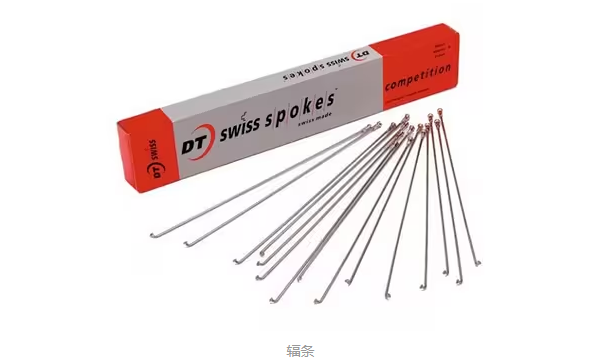
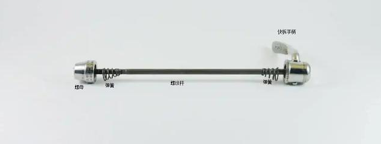

# 公路车自组

> 博主提供上门组装自行车服务，如有需要，可联系

## 我的第一辆自组公路车

轮组：pasak铝圈 /车圈40MM    五爪塔基   支持700x25c   支持法嘴          ￥389

车架+前叉：iZip铝合金圈刹车架、碳纤维椎管前叉    快拆    圈刹                ￥1200

SUMC速盟9速链条                                                                                            ￥48

日辉9速飞轮 11-28T 																						 ￥39

正新外胎 700x25c       两条																			   ￥62

建大内胎 700x23/25c   法嘴加上60mm    两条                                              ￥34

UNO三件套 （弯把+把立+后飘坐管31.6mm）											  ￥208

刹车夹器 ONIRII 奥利尼BC-02 铝圈                                                                 ￥158

SENSAH顺泰手变 2*9速                                                                                    ￥244

禧玛诺后拨M2000 9速      																				 ￥86

禧玛诺TY300前拨 34.9mm																				￥28

浩盟牙盘+中轴 34-50T                                                                                        ￥198

铝合金脚踏一对                                   																 ￥62

头盔																													   ￥329

前照灯																												   ￥ 38

尾灯                                                              												         ￥ 39

ONIRII 奥利尼 3d打印坐垫																				 ￥ 139

总计：￥389+ ￥1200+ ￥48+ ￥39+ ￥62+ ￥34+ ￥208+ ￥158+ ￥244+ ￥86+ ￥28+ ￥198+ ￥62+ ￥329+￥ 38 +￥ 39 + ￥139  = ￥3301

下面是购买的组装工具：

内六角工具																							  			￥29

界面脂                               																					￥29

苹果酱润滑油									                                    								￥13

微型打气筒																											￥13

活动扳手																											    ￥23

卡飞套筒                                 																			   ￥12.5

中轴扳手 外经44mm 16齿											                                      ￥22

前叉截断工具																									    ￥29

前叉花心安装工具+橡胶锤																				   ￥28

总计：￥29+￥29+￥13+￥13+￥23+￥12.5+￥22+￥29 + ￥28= ￥318.5

> 以下知识为博主网络收集和自己对组件的相关见解，如有错误可联系更正，侵权可删

## 安装注意指南

### 1、界面脂和苹果酱区别

苹果酱也叫做润滑脂、黄油

苹果酱可以替代界面油，界面油不可以替代苹果酱
界面油用在不相对运动的地方，苹果酱用在相对运动的地方
这句话你可以简单理解成不同零件产生接触安装但不会相对运动的地方用界面油，例如中轴轴套与五通之间，尾勾与车架之间、碗组轴承的外圈和车架连接处。作用是填充微小缝隙防止异响、防尘防水、防融合。
零件产生接触且需要相对运动的地方用苹果酱，例如轴心和轴套之间，作用是润滑、防尘防水、填缝、防融合。

界面油和苹果酱，都可以起到填缝、防尘防水防融合的目的（在零件中间充当物理隔离）
界面油的粘稠度更高，耐挤压、耐高温、耐酸碱的能力也比苹果酱强。
可以看作不需要相对运动的地方，苹果酱足以胜任，界面油更好。

界面脂涂抹：塔基与飞轮、螺纹与五通、车架与尾钩、尾钩与后拨

苹果酱涂抹：

### 2、链条安装

长度选择可根据牙盘数量决定，单盘、双盘和三盘皆有所不同

单盘：

对于单盘来说，链条挂至 最大盘和最大飞轮，确定长度后再增加两个链节就可以了

### 3、飞轮安装

飞轮安装得有相应的套筒工具，卡飞对应卡飞套筒，旋飞对应旋飞套筒。

在塔基上涂界面脂，把卡飞安装到塔基上，对应插槽，装上卡飞套筒，配合活动扳手，稳固飞轮与轮组。

# 1、车架

在自组自行车的时候，车架的选择一般是最重要的，也是自组自组自行车的第一步。

<mark>因为车架的选择 决定 你是圈刹还是碟刹 、决定你的轮组大小、前叉大小、中轴规格</mark>

<mark>车架的尺寸也很重要，根据你的身高、跨高等一系列参数</mark>

车架从材质上大致分为 **碳纤维**、**铝合金**

**碳纤维材料的优点**：

在自行车领域，碳纤维车架、车把等主要结构零部件的优势非常明显，重量轻、强度大、刚性强、可塑性高，是用于制造高级运动自行车零部件的理想材料，如果是应用于赛场或高强度运动骑行，碳纤维具有极为出色的性能。

可塑性：

碳纤维材质基本可以制成任何所需的形状，且表面完全感觉不到接驳的痕迹，除了可以造出更酷造型的自行车，在空气动力学方面，碳纤维材质的高可塑性也占尽优势。

重量：

碳纤维材质具有非常轻的重量，是非常理想的轻量化材料。

刚性：

碳纤维材质自行车零件并不像人们传统印象中的那样不堪一击，而是具有非常高的刚性——高质量的碳纤维车架，刚性高于铝合金车架。所以，如果是应用于赛场或高强度运动骑行的自行车车架、车把、轮组，都会使用碳纤维复合材料来制造。

价格：

价格相对铝合金来说，是偏贵的

**铝合金材料**：

无论是哪个级别的自行车，都会是使用到铝合金这个材质。铝合金车架也有它的优势，重量与刚性虽然比不过碳纤维，但也足够轻，价格也更亲民，如果不是用于赛场，参加高强度的竞赛骑行，铝合金车架也是不错的选择。铝合金车架还方便携带货架与挡泥板，方便长途骑行。价格相对亲民一些。

具体怎么选择 看自己需求

# 2、轮组

轮组基本由三大部分组成：**轮圈、辐条、花鼓**

他们最后组成轮组

公路自行车轮径大小是以英寸（in）为单位的，而700C只是一种轮圈规格，具体尺寸需要转换一下。

700C x 25C 中的700C指的是轮组的**直径长度**，25C指的是**轮组的胎的宽度**。

一般而言，700C的公路车轮圈尺寸是622mm，而不是700mm。这个数字是指轮圈的直径，测量方式是轮圈内部两边的距离。这意味着，当您购买700C的公路车轮胎时，其实是选购与622mm尺寸相对应的轮胎。因此，如果要用[公制单位](https://www.zhihu.com/search?q=公制单位&search_source=Entity&hybrid_search_source=Entity&hybrid_search_extra={"sourceType"%3A"answer"%2C"sourceId"%3A3083830211})来表示，则700C的轮圈直径为约622mm

常说的"40刀"”60刀“是什么意思，他指的是轮圈的框高，一般不同的框高对应不同的道路情况

从图片上很容易能够看出来框高不同的轮组有什么差别，我们区分一款轮组是爬坡轮还是综合轮还是气动轮大部分情况也是从框高来判断的，过去传统意义上来说30mm以下定义为低框爬坡轮，40mm左右定义为综合，50mm及以上定义为高框气动轮组，现在因为工艺进步40mm以下已经可以被定义为爬坡轮，而50mm被定义为综合轮，60及以上被定义为气动轮。 

## 轮组安装方式

轮组的安装方式现在一般分为 **快拆式**、**桶轴式**

### 快拆式

快拆轴通常由**螺纹杆、快拆手柄、螺母和两个锥形弹簧组成。而使用快拆的前叉和后叉，通常有一个U形勾爪，方便拆卸**。

快拆：顾名思义就是拆卸和安装速度较快。一般就是卸下螺母，然后螺纹杆穿过轮组，然后将整个轮组放到车架前叉或者后叉（取决于你是安装前轮还是后轮），通过旋转 螺母或者螺纹杆，拧紧后，就可以了。

### 桶轴式

桶轴无疑是快拆最好的替代品，对于越野车和速降车，快拆轴的会在自行车的行驶在复杂的路面断裂弯曲，甚至弹离自行车，造成安全隐患，同时带有碟刹的山地车，快拆轴更容易发生蹭碟现象。出于这个原因，制造商制造了桶轴。

桶轴更坚固，同时桶轴的前叉孔是封闭的而不是开口，车轮基本不会出现松动问题。

快拆轴总是配有一个快拆手柄，而桶轴有的不带快拆手柄，需要额外的工具才能进行拆卸。当然也有桶轴带快拆手柄的。

快拆轴的一端是快拆手柄，另一端则是一个螺母。而桶轴有一端是带有螺纹的，以方便拧入前叉。两者的直径也明显不同，最细的桶轴直径10mm，而快拆轴一般只有5毫米。

两者的前叉扣不一样，一个是闭合的，一个是U形的，理论上两者是不通用的。

# 3、轮胎

有三种类型的公路外胎，分别是：开口胎、真空胎、管胎，每种类型需要一个特定的轮圈。

我的建议是使用内外胎，也就是开口胎。开口胎价格便宜，一般几十不等，但是真空胎最便宜也是百元以上。其次，开口胎维修简单，就算是自己在路上爆胎了，也能自己修好，但是真空胎坏了只能直接换。

## **开口胎科普**

开口胎是指使用单独的内胎来储存空气的轮胎，这是自行车上最常见的轮胎类型。一般来说，在没有提到轮胎类型的地方，可以放心地认为它是一个开口胎。

通常都有内胎和外胎，内胎负责储存空气，外胎负责保护内胎。

## **管胎科普**

管胎，并不是什么新东西了，虽然它们也是有内胎结构，内胎被与套管缝合在一起，然后粘合到轮圈上。考虑到这一点，很容易看出为什么管胎最适合竞赛的，轮胎与轮圈都拥有极低的自重，并且一旦出现穿孔过大的爆胎，很少有一般车手可以简单地（或可靠地）在路上修复它们。

## **真空胎科普**

真空胎是一种在汽车、山地车中得到充分证明的轮胎，越来越多的品牌开始向公路车推广其优势——无内胎结构，可降低轮胎自身重量以及降低滚动时内外胎阻力，从而拥有更好的滚阻表现。同时，真空胎轮组也可以向下兼容使用开口胎，在真空胎受到自补液无法填补的穿刺后，可加入内胎继续骑行。

## 轮胎大小选择

一般轮胎的大小选择都是根据**<mark>轮组的大小</mark>**来决定的。

对应尺寸的外胎就要选择对应尺寸的内胎。一般外胎的上面都会标注型号。

一般的公路、死飞车的外胎型号可能是700x23c,700x25c,700x28c；

一般的山地车，外胎型号可能是：26x1.95,26x1.75,26x1.5；

一般20寸折叠车，外胎型号可能是：20x1.95,20x1.75,20x1.5；

图为700x28c和20x1.5的轮胎的胎壁上型号展示(您确认的时候只需要找到这样的数字型号即可)

外胎型号确定了，内胎的型号也就确定了，只要与外胎配套就可以。但内胎是区间的，您选择的内胎区间包含外胎的这个尺寸就好。如700x28c外胎，内胎就选择700x28/32的就可以。26x1.95外胎，内胎选择26x1.9/2.125的内胎就可以。

还有就是气嘴长度和气嘴类型也要**<mark>根据你的轮组</mark>**来决定。

市场上现在总共有三种气嘴类型，一种是美式气嘴，简称美嘴，一种是法式气嘴，简称法嘴，还有一种是英式气嘴，也就是早期的可以把气门芯拔出来的那种。现在市面上已经基本没有了。

具体您该选择美嘴还是法嘴，那么，您以前使用什么气嘴，就任然使用什么类型气嘴就好。<mark>选择法嘴的，打气时需要美嘴法嘴转换器。无转换器无法打气的哦！</mark>

美嘴一般的只有两种长度，一种32L(32mm)，也就是3.2厘米的长度，大多数山地车都是这种。一种是48L(48mm)，也就是4.8厘米的长度，普通山地车有的使用加厚圈，就需要使用加长的气嘴。

法嘴有4种长度，35mm的，48mm的，60mm的，80mm的。

那到底如何选择气嘴的长度，在此教大家使用一个公式。

**气嘴的长度-车圈的厚度≥2cm(这个长度就是露在外面的)**

如果气嘴太短，安装之后气嘴露在外面的就太短，就打不了气。所以，用了这个公式，您去目测一下您车圈的厚度，然后就可以知道该选择的气嘴的长度了。

# 4、飞轮

飞轮指的是后轮的转动机制，与链条相连，一般会说 9速、11速、12速：指的是飞轮的可调节的档位数，9速指的就是有9个档位，11速就是指有11个档位。

飞轮分为<mark>卡式和旋式</mark>：卡式指的是在安装时，与轮组的花鼓有插槽一一对应         旋式指的是在安装时，与轮组的花鼓链接的是一个螺丝，通过旋转飞轮，拧紧来连接花鼓。

### **卡式飞轮**（卡飞）：

之所以这样命名，是因为它的安装方式是直接插在后花鼓（即后车轴）的塔基上，并以一个螺纹式的飞轮上盖进行压紧。

卡式飞轮的棘轮结构（也就是当你骑车是不进行任何踩踏，后轮空转时发生“咔咔”响声的来源所在）在花鼓的塔基内部，飞轮仅为数个齿片组成，不具有任何复杂的内部结构。

卡式飞轮的卡口分为日规（Shimano规格）和意规（Campagnolo规格）两种，其中，日规占大多数，意规则在使用Campagnolo传动／变速套件的公路车上较为多见。

感觉日式与意式得区别就是卡槽的深浅

### **旋式飞轮**（旋飞）：

旋式飞轮通过飞轮上自带的螺纹，将飞轮直接拧紧在旋式花鼓的螺纹上。

旋式飞轮的棘轮结构在飞轮内部，而非在花鼓上，传统[自行车](https://www.qibuluo.com/bike/)的单速飞轮，同样属于这种结构

由于结构更加稳定、重量更轻，且能够将最小齿片制作得更小，现代运动自行车中的中高端级别产品多采用卡式飞轮，而旋式飞轮则多见于[单速车](https://www.qibuluo.com/bike/list-5-0-1.html)、攀爬车（将旋飞前置在牙盘位置）、老式变速运动自行车以及低端入门级别的运动自行车。目前，旋式飞轮最多可做到10片齿片，即10速，而卡式飞轮则已经拥有12速的款式。

### 飞轮参数

举个栗子：飞轮一般会说 几速 多少-多少T  ，比如：9速 11-28T

9速指的是有9个飞轮片

11指的是最小的飞片有11个齿

28指的是最大的飞片有28个齿

# 5、套件

## 前拨

前拨是变速系统的重要组成部分，负责牙盘档位准确快速的升降。

1、从前拨的安装方式上，大致分为两类：坐管安装前拨、中轴（五通）安装前拨。以下这两种是较常见的坐管安装前拨，即前拨卡箍安装在坐管上。

以下是中轴（五通）安装前拨（也称E型前拨），即前拨通过五通处的中轴加以固定。相对于坐管安装前拨，它要求的配套牙盘、中轴等更精确一些，安装调试的局限性大一些。

2、从前拨的拨臂运动方式上，大致分为两类：上摆式前拨、下摆式前拨。以下是上摆式前拨。上摆式前拨的移动部分设在比下摆式前拨移动部分的位置要更高一些（以卡箍为衡量基准），连接零件短，刚度更高，从而可能实现迅速而轻松的变速。左边是下摆式前拨，右边是上摆式前拨

3、从前拨的走线方式上（无论上摆式还是下摆式），大致分为上拉式前拨、下拉式前拨。（这里不单独列出双拉式，因为最终的使用结果必然只有一种，非上拉既下拉）（1）上拉式前拨又有上摆和下摆之分：左边是上摆的上拉走线式前拨，右边是下摆的上拉走线式前拨

（2）下拉式前拨也有上摆和下摆之分：左边是上摆的下拉走线式前拨，右边是下摆的下拉走线式前拨

## 后拨

## 牙盘

## 中轴

> 参考链接：[https://zhuanlan.zhihu.com/p/38369273](https://zhuanlan.zhihu.com/p/38369273)

随着自行车的不断发展，自行车上不断涌现着各式各样的中轴标准，让不少车友眼花缭乱，最近呢，我也遇到了一些对中轴标准了解地云里雾里的车友，那么今天，我来给大家仔细梳理一下自行车的中轴标准以及其相互之间的兼容性。

​    首先，我们必须要知道的一件事，就是牙盘装在车架的五通（什么是五通？五通就是和牙盘盘片所在平面垂直的那根很窄的管子）里，中轴相当于一个转换接口，让车架和牙盘能按我们期望的方式传递我们的能量。所以，中轴，不仅关乎牙盘，更关乎车架。

我们先说五通，五通指的是车架上的中心点的管子，就是同时连接五个管材的位置并和其相同的部分。因为五通处位于车架前三角后后三角的下端交叉位置，连通立管、下管和两根后下叉的交叉位置，加上本上就是一根贯穿的管子，总共为五个方向相通，因此被称为“五通”，五通位置通常为自行车安装中轴的预留位置。下图即为自行车架的五通。

### 车架上五通的标准：

**意式螺纹五通（ITA）**，一般只出现在古老的意大利老牌公路自行车上，两侧皆为正向螺纹。意式五通在国内能见度相对较低，需要配合专用的意式中轴使用，专用于公路车架。

**压入式BB90/92型五通**，该系列五通采用的是压入式安装方法，最早由禧玛诺和崔克共同研发并推广。其中BB90车架五通宽度为89.5mm，BB92型车架宽度为92mm。

**压入式BB86型五通**，该系列五通是常见的压入式中轴车架使用标准五通，由禧玛诺和捷安特开发并推广。其中86代表五通长度为86mm。

**压入式BB30型五通**，这是FSA和佳能戴尔共同研发并推广的五通规格，“30”代表牙盘轴心的直径为30mm。

**英式螺纹五通（BSA）**，一般自行车上最常见的五通标准。其特点是兼有正向和反向螺纹。其中左侧为正向螺纹，应顺时针旋转扭紧；右侧（靠近牙盘一侧）为反向螺纹，应逆时针拧紧。BSA规格五通在公路车架和山地车架上最为常见，其五通宽度大多为68mm或者73mm（其中DH车架可能有83mm的五通宽度）。

**T47规格五通，**手工车架和部分新的车架中比较流行的新兴规格五通，最早由Chris King与Argonaut Cycles联合推出的。其实可以理解为螺纹式BB386规格。T47规格中轴还有非常多的变种，还按照梧桐长度分为：T47-68/86/85.5还有一个最特殊的T47A-77规格。

### 中轴系统的种类：

以安装标准来划分中轴的话，主要有螺纹式和压入式，螺纹式中轴包括方孔中轴、花键中轴和部分外挂培林中轴，而压入式中轴均为外挂培林中轴。

## 手变

## 把立

