# 基础知识科目-计算机系统基础知识

计算机五大基本组成部件：运算器、控制器、存储器、输入设备、输出设备等部件

而运算器、控制器等部件被集中到一起被称为<mark>中央处理单元</mark>（CPU）

## 1、CPU

CPU有两大基本组成部件：<mark>运算器</mark>、<mark>控制器</mark>

**CPU的功能**：<mark>获取程序指令，将程序指令进行译码操作并加以执行</mark>

控制器包括：

​	**1、程序控制**：CPU通过执行指令来控制程序的执行顺序。

​	**2、操作控制**：一条指令的执行需要若干个操作信号来配合实现，CPU产生每条指令的操作信号并将操作信号送外指定的部件，控制相应部件进行相应的操作。

​	**3、时间控制**：CPU对各种操作进行时间上的控制。

运算器包括：

​	**4、数据处理**：CPU对数据进行算数运算和逻辑运算等方式对数据进行加工处理，最后结果被人们所利用。这是CPU的最根本任务。

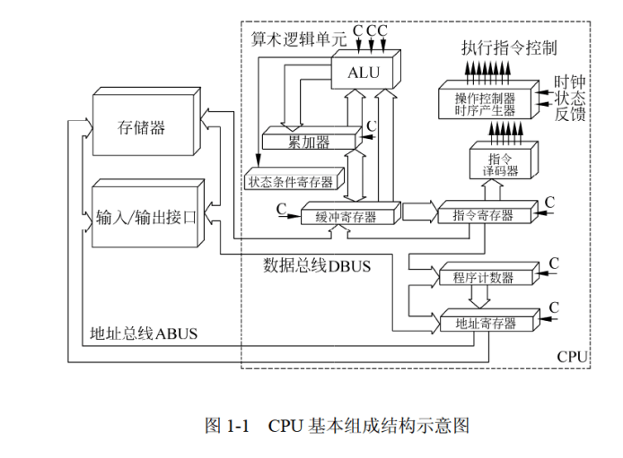

### 1.1 运算器

运算器是CPU的两大基本组成部件之一。

运算器由<mark>算术逻辑单元、累加寄存器、数据缓冲寄存器、状态条件寄存器</mark>等部件组成。

它是数据处理加工部件，用于完成计算机的各种算术计算和逻辑运算。<mark>运算器接受控制器的命令而进行动作</mark>，所有运算器的操作都由控制器所发出的控制信号来指挥，所以它是<mark>执行部件</mark>

运算器两大功能：

​	1、执行所有的算术运算（例如：加减乘除及附加操作）

​	2、执行所有的逻辑运算并进行逻辑测试。

运算器各部件功能：

​	1、<mark>算术逻辑单元（arithmetic and logic unit）（ALU）</mark>：ALU负责处理数据，实现对数据的算术运算和逻辑运算。

​	2、<mark>累加寄存器 (Accumulator register)（AC）</mark>：AC累加寄存器，它实际上是一个通用寄存器，是在ALU进行算术运算或者逻辑运算时，为ALU提供一个<mark>工作区</mark>。

​	3、<mark>数据缓冲寄存器（Data Register）（DR）</mark>：CPU在对内存、外部设备上的数据进行读写操作的时候，用DR暂存读写的一条指令或者一个数据字，将不用时间段的数据隔离开来。

​	4、<mark>状态条件寄存器（Program Status Word）（psw）</mark>：就是一些在算术运算和逻辑运算中出现的状态标志。分为状态标志和控制标志。

### 1.2 控制器

运算器只能完成程序的运算，而控制器控制整个CPU的工作。它不仅要保证程序的正常执行，还要能够<mark>处理异常事件</mark>。

控制器一般包括<mark>指令控制逻辑、时序控制逻辑、总线控制逻辑和中断控制逻辑</mark>等部分

指令控制逻辑包括4个部件：

​	1、<mark>指令寄存器（Instruction Register）（IR）</mark>：当CPU执行一条指令的时候，先从内存读到数据缓冲寄存器（DR）中，再送到指令寄存器（IR）暂存，指令译码器根据IR的内容产生微操作指令，控制其他部件操作。

​	2、<mark>程序计数器（Program Counter）（PC）</mark>：PC具有寄存信息和计数两种功能，又称指令计数器。程序计数器是用于存放下一条指令所在单元的地址的地方。

当执行一条指令时，首先需要根据PC中存放的指令地址，将指令由内存取到[指令寄存器](https://baike.baidu.com/item/指令寄存器/3219483?fromModule=lemma_inlink)中，此过程称为“取指令”。与此同时，PC中的地址或自动加1或由转移指针给出下一条指令的地址。此后经过分析指令，执行指令。完成第一条指令的执行，而后根据PC取出第二条指令的地址，如此循环，执行每一条指令。

​	3、<mark>地址寄存器（Address Register）（AR）</mark>：用来保存当前CPU所访问的内存单元的地址。由于在内存和CPU之间存在着操作速度上的差别，所以必须使用地址寄存器来保持地址信息，直到内存的读/写操作完成为止 。

​	4、<mark>指令译码器（Instruction Decoder）（ID）</mark>：指令分为操作码和地址码。操作码表示执行的操作性质，即要执行什么操作；地址码是操作码要执行的操作对象的地址。

## 2、计算机基本单位

比特（bit 简写b）< 字节（byte 简写B  ）< 千字节 （KB）< 兆字节（MB）< 吉字节（GB）< 太字节（TB）

1B = 8b；

1KB = 1024 B；

1MB = 1024KB；

......

**计算机最小的数据单位是bit；计算机最小的存储单位是byte；**

计算机进制：

​	<mark>n进制转成十进制</mark>：展开扩展法（乘以n的位数次方再相加）

​	<mark>十进制转成n进制</mark>：除n取余法（除以n，直至商为0），再<mark>倒取余数</mark>拼接

n进制的加法：<mark>遇n进1</mark>，n进制的减法：<mark>往前借1当n</mark>；

## 3、数据表示

数据在计算机中的表示都是为<mark>二进制</mark>，这些数据在计算机里被称为<mark>机器数</mark>。

机器数有两种，一种是<mark>有符号数</mark>，一种是<mark>无符号数</mark>。

在有符号数之中，计算机采用原码、反码、补码、移码等不同的编码方式，机器数的这些编码方式被称为码制。

### 3.1 原码

在原码中，最高位表示符号位，0表示正数，1表示负数，其余n-1位表示数据的绝对值。

8位机器字长的数值0的原码表示有两种方式：<mark>[+0]原=0 0000000  [-0]原=1 0000000</mark>

### 3.2 反码

在反码中，最高位也是符号位，0表示正数，1表示负数。正数的反码与原码一样，<mark>但是负数的反码除了最高位也是1，其余剩下之位全部取反</mark>。

### 3.3 补码

在补码中，最高位也是符号位，0表示正数，1表示负数。正数的补码与反码与原码一样，但是<mark>负数的补码是在反码的基础之上最后位加1</mark>；

在补码中，0有唯一的编码：<mark>[+0]补=00000000 、[-0]补=00000000</mark>

### 3.4 移码

移码是在补码的基础上，将最高位，也就是符号位取反，无论它是正数还是负数。

在移码中，0也有唯一的编码 ：<mark>[+0]移 = 10000000、[-0]移 = 10000000</mark>

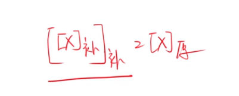

**注意：一个数补码的补码就等于它的原码**。

机器布长为n时，这些码制所表示的范围。

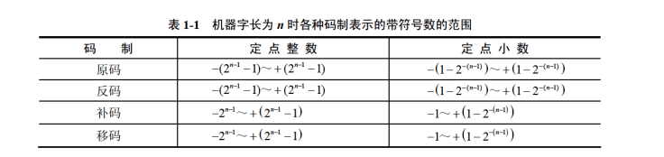

### 3.5 浮点数

上面的原码、反码、补码、移码的规则都是对应整数的表示法。

而小数的表示法为$N=2 ^ E \cdot F$。例如：$0.1100\cdot  2^4 = 0.01100 \cdot 2^5 $

其中E被称为<mark>阶码</mark>，F被称为<mark>尾数</mark>，用阶码和尾数来表示的数被称为浮点数，这种表示数的方法被称为浮点表示法。

很明显上面的浮点数表示法，可以用多种形式去表示同一个浮点数。

<mark>浮点数所能表示的数值范围主要由阶码决定，所表示数值的精确度由尾数决定。</mark>

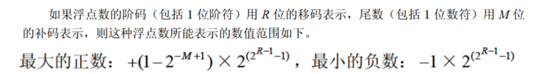

### 3.6规格化浮点数

规格化浮点数就是就是将尾数的绝对值限定在<mark>[0.5,1]</mark>之间；

## 4、寻址

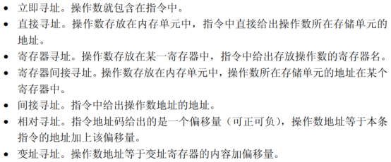

## 5、校验码

由于在计算机中，数据需要传输，在传输过程中，可能数据会出现错误的情况，那么这个校验码就是<mark>校验数据是否传输错误</mark>

校验码分为:1、奇偶校验码 2、海明码 3、循环冗余校验码

### 5.1 奇偶校验码

奇偶校验是指  在原来的编码中增加一位校验码来使编码的中1的个数为奇数或者偶数，从而使码距变成2。

对于奇偶校验码来说，<mark>只能当出错的编码个数为奇数时，才能发现，他不能发现出错的编码个数为偶数，换句话说，当出现编码出错个数为偶数时，他会误认为没有错</mark>

奇偶校验码<mark>只能检错，不能纠错</mark>

### 5.2 海明码

码距=2，只能检错，码距>=3，才可能能纠错；

海明码<mark>可以检错，也可以纠错</mark>

海明码的构成方法是在数据位之间的特定位置插上k个校验位，通过扩大码距来实现检错和纠错。

假设数据位是n位，校验位是k位，则n和k必须满足以下关系：

$2^k-1>=n+k $

### 5.3 循环冗余校验码

循环冗余校验码也<mark>只能检错，不能纠错</mark>；说明他的码距为2

循环冗余校验码生成多项式为k个数据位，产生r个校验码，其编码长度为k+r。

左边是数据位，右边是校验位；

## 6、RISC和CISC

|                  |     RISC（精简指令集计算机）     | CISC（复杂指令集计算机） |
| ---------------- | :------------------------------: | :----------------------: |
| 指令种类         |             少，精简             |         多，丰富         |
| 指令复杂度       |            低（简单）            |        高（复杂）        |
| 指令长度         |               固定               |           变化           |
| 寻址方式         |                少                |         复杂多样         |
| 实现（译码）方式 | 硬布线控制逻辑（组合逻辑控制器） |      微程序控制技术      |
| 通用寄存器数量   |             多，大量             |           一般           |
| 流水线技术       |               支持               |           支持           |

## 7、流水线

流水线指的是 指令在执行过程中的的流水线。

指令的执行需要先<mark>输入（I）、计算（C）、输出（O）</mark>

如果是顺序执行，那么三个工作分别进行。那么执行的效率不高。如果三个部件同时工作，那么执行效率很高。

<mark>加速比：不采用流水线执行时间/采用流水线执行时间</mark>

<mark>流水线的操作周期：一条指令的最长操作时间</mark>

<mark>流水线的吞吐率：（单位时间内可以输出多少结果）一条指令的最长操作时间分之一</mark>

n条指令的执行时间：

​	顺序执行：<mark>一条指令的时间 乘以n</mark>

​	流水线执行：<mark>一条指令执行的时间+最长操作时间乘以（n-1）</mark>

<mark>n条指令的吞吐率：总指令数（就是n）/总花费时间</mark>

## 8、存储器

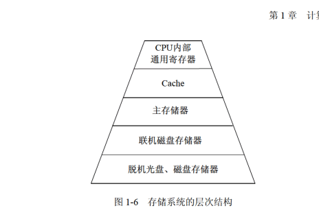

<mark>DRAM（动态随机存储器）构成主存 DRAM需要周期性地刷新保持信息</mark>

<mark>SRAM（静态随机存储器）构成Cache</mark>

存储器的分类：

（1）按存储器的位置分类：<mark>内存与外存</mark>

​	内存：也叫主存，其实就是内存条。其特点是：容量小，但是速度快。

​	外存：也称为辅存，如：磁盘、磁带、光碟。其特点是 容量大，但是速度相对与内存更慢。

（2）按存储器的材质分类：<mark>磁存储器、半导体存储器、光存储器</mark>

​	磁存储器：使用磁性介质制作，如：磁芯、磁带、

​	半导体存储器：半导体存储。

​	光存储器：利用光学方法读/写数据的存储盘，如：光盘

​	(3) 按存储器的工作方式分类：

​	【1】<mark>读/写存储器</mark>。它既能读取数据也能存入数据。

​	【2】<mark>只读存储器</mark>。只能读取数据，根据数据的写入的方式，这种存储器还能细分为：

​		[1]：固定只读存储器（Read Only Memory）（ROM）

​		[2]：可编程的只读存储器（Program Read Only Memory）（PROM）

​		[3]：可擦除可编程的只读存储器（Erasable Program Read Only Memory）（EPROM）	

​		[4]：电擦除可编程的只读存储器（Electrically Erasable Program Reda Only Memory）（EEPROM）

​		[5]：闪速存储器（Flash Memory），简称闪存。闪存以<mark>块</mark>为单位删除数据。<mark>例如 U盘</mark>，可以代替ROM，不能代替主存。

​	（4）按照访问方式分类：

​		<mark>按地址访问的存储器</mark>

​		<mark>按内容访问的存储器</mark>

​	（5）按寻址方式分类：

​		<mark>随机存储器</mark>：这种存储器对任何存储单元存入或者读取数据，访问任何一个存储单元需要的时间是相同的

​		<mark>顺序存储器</mark>：访问数据所需要的时间与数据所在的存储位置相关，磁带是典型的顺序存储器

​		<mark>直接存储器</mark>：介于随机和顺序存取之间的一种寻址方式。磁盘是一种直接存储器，他对磁道的寻址是随机的，而在一个磁道内则是顺序寻址。	

### 8.1相联存储器

​		相联存储器是一种<mark>按内容访问</mark>的存储器。

​		<mark>虚拟存储器是由主存加辅存一起构成的</mark>。

### 8.2 高速缓存（Cache）

高速缓存用来存储当前最活跃的程序和数据，其特点是：<mark>位于CPU和主存之间</mark>；容量在几千字节到几兆字节之间；<mark>速度一般比主存快5~10倍</mark>，<mark>由快速半导体存储器构成</mark>；其内容是主存局部域的副本，<mark>对程序员来说是透明的</mark>。

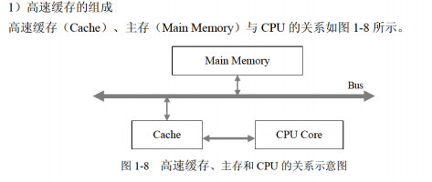

​	Cache存储器部分用来存放主存的部分拷贝(副本)信息。控制部分的功能是判断CPU要访问的信息是否在Cache存储器中，若在即为命中，若不在则没有命中。命中时直接对Cache 存储器寻址；未命中时，要按照替换原则决定主存的一块信息放到Cache存储器的哪一块里。

#### 8.2.1 Cache替换算法

CPU每次从Cache中获取数据，当数据不在Cache中，会从主存中读取到Cache中，当Cache满了之后，就会有Cache替换算法，算法的目标是使Cache获得尽可能高的命中率。常用的算法：

（1）随机替换算法

（2）先进先出算法

（3）近期最少使用算法

（4）优化替换算法

一般来说，Cache容量越大，命中率越高。

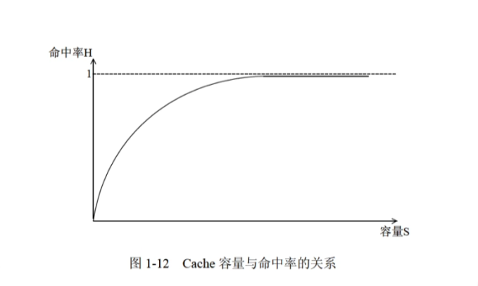

#### 8.2.2地址映像方法

在Cpu工作时，送出的是主存单元的地址，而从Cache存储器中读/写信息。这就需要将主存地址转换成Cache中的地址，这种地址的转换叫地址映像方法。Cache的地址映像方法有3种：

（1）<mark>直接映像</mark>：主存的块与Cache的块的关系是固定的，一一对应。特点：冲突大

（2）<mark>全相联映像</mark>：Cache的块是随机的，主存的块可以融合到Cache中的任意一块（前提这个块没有被占）。特点：冲突小

（3）<mark>组相联映像</mark>：对主存的块进行分组，对Cache的块进行分组。组与组之间是直接映像，但是组内又是全相联映像。特点：冲突较小

## 9.输入输出技术

### 9.1中断

计算机在执行程序的过程中，当需要紧急事件处理时，暂停当前运行的程序，去执行有关服务的程序，处理完后自动返回源程序，这个过程叫做<mark>中断</mark>

中断时一种很重要的技术，在输入输出设备、分时操作、实时系统、计算机网络都用到了这种技术。为了提高响应中断的速度，通常把<mark>所有中断服务程序的入口地址（</mark>称为中断向量<mark>）汇集为中断向量表</mark>

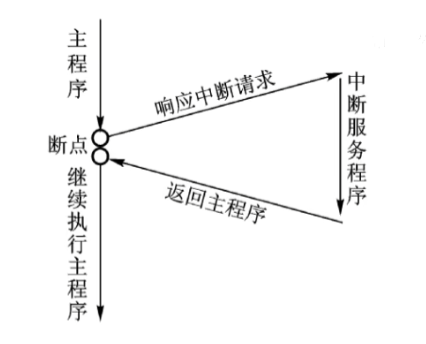

<mark>中断向量</mark>：提供中断服务程序的入口地址
<mark>中断响应时间</mark>：从发出中断请求到开始进入中断处理程序
<mark>保存现场</mark>：为了正确返回原程序继续执行

### 9.2 输入输出（I/O）控制方式

#### 9.2.1 程序查询方式

程序查询方式，也叫<mark>程序直接控制（直接程序控制）</mark>

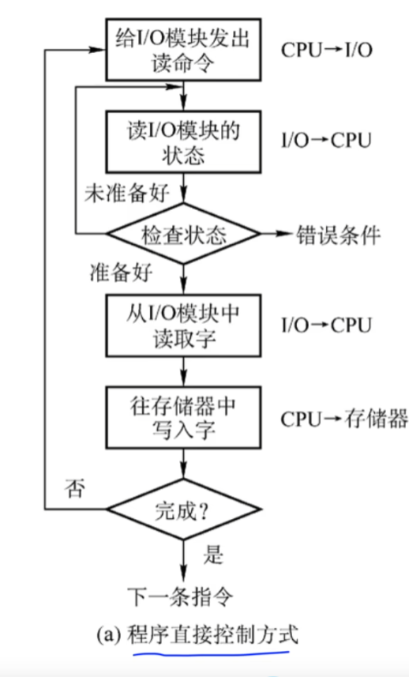

流程分析：

1、CPU向IO模块发出读的指令

2、查看IO模块是否准备好，没准备好重新发起读的指令

3、准备好了，IO模块开始读取字节，一次只能读一个字节

4、IO模块往存储器写入字节

5、IO模块监测是否已完成指令

<mark>程序直接控制方式特点</mark>：

【1】<mark>CPU和I/O(外设)只能串行工作。CPU需要轮训检查IO模块是否准备好，并且一直处于忙等状态。CPU利用率低</mark>

【2】<mark>一次只能读一个字节</mark>

【3】<mark>由CPU将数据放入内存中</mark>

【4】<mark>需要CPU保护现场</mark>

#### 9.2.2 中断驱动方式

中断驱动方式，是利用了中断这一特性

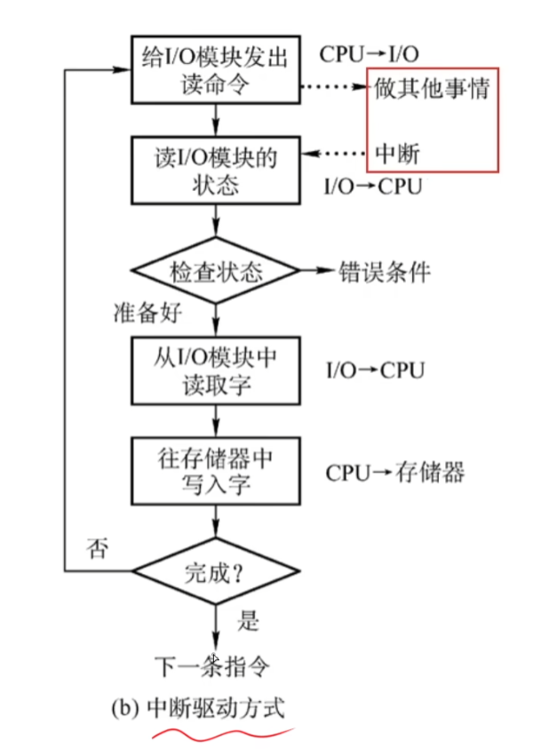

中断驱动方式流程与直接程序控制的流程大致相同，<mark>区别主要在于CPU在发出让IO模块读取指令后，可以去做其他事情</mark>，IO模块在读取完数据后，给CPU发出中断请求，现在CPU会停止手上的事情，马上来处理读取到的数据，处理完后CPU又去做自己的事情。

中断驱动方式特点：

【1】<mark>I/O设备通过中断信号主动报告I/O操作已完成</mark>

【2】<mark>CPU和I/O设备可并行工作</mark>

【3】<mark>CPU的利用率大大提高</mark>

【4】<mark>由CPU把数据放到内存中</mark>

【5】<mark>一次也只能读取一个字节</mark>

【6】<mark>需要CPU保护现场</mark>

#### 9.2.3 直接存储器方式（DMA）

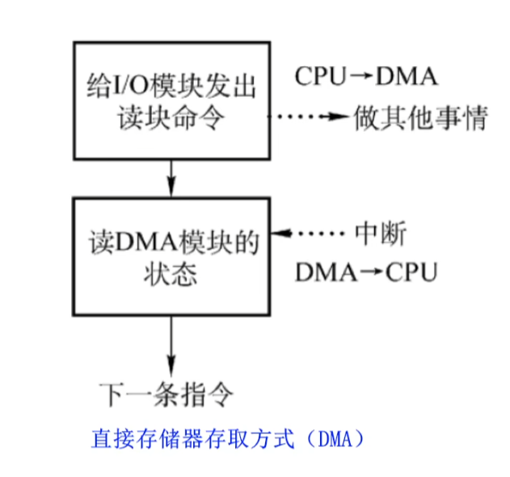

直接存储器存取方式与中断驱动方式大致相同，只不过CPU把命令权交给了DMA

直接存储器存取方式特点：

【1】<mark>CPU和I/O设备可并行工作</mark>

【2】<mark>仅在传送数据块的开始和结束才需要CPU的干预</mark>

【3】<mark>由外设将数据存储内存中</mark>

【4】<mark>一次读写的单位是“块”，不是字节</mark>

【5】<mark>不需要CPU保护现场</mark>

## 10.总线

总线分类：<mark>数据总线、地址总线、控制总线</mark>

PCI总线：<mark>是一种内总线，采用并行的传输方式</mark>

## 11. 可靠性

系统的可靠性区分为串联和并联：

1、**串联系统**：假设一个系统由N个子系统组成，当且仅当所有的子系统都正常运行的时候，系统才能正常工作，这种系统被称为串联系统：

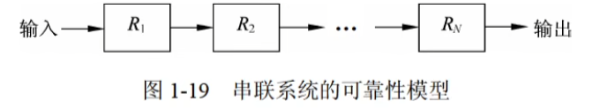

设系统中各个子系统的可靠性分别用 R~1~  ，R~2~，R~3~.....R~n~来表示，则<mark>系统可靠性公式为</mark>：

​																R= R~1~R~2~R~3~.....R~n~

2、**并联系统**：假设一个系统由N个子系统组成，只要有一个子系统运行，系统就能正常工作，这样的系统被称为并联系统。

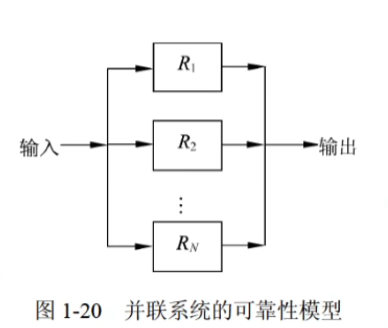

设系统中各个子系统的可靠性分别用 R~1~  ，R~2~，R~3~.....R~n~来表示，则<mark>系统可靠性公式为</mark>：

​														R=1-（1-R~1~）（1-R~2~）(1-R~3~)....（1-R~n~）

## 12、程序设计语言

### 1、低级语言、高级语言  、解释器、编译器

计算机硬件只能识别由0、1组成的机器指令序列，即机器指令程序，因此机器指令是最基本的计算机语言。用机器语言进行程序设计时效率很低。所以人们发明了汇编语言：汇编语言将机器语言用负号代替，这种语言的集合被称为汇编语言，<mark>这种机器语言和汇编语言被称为低级语言</mark>

在此基础上，人们开发了功能更强、抽象级别更高的语言以支持程序设计，于是就产生了面向各类应用的程序设计语言，<mark>称为高级语言</mark>。常见的有Java、C、C++、PHP、Python、Delphi、PASCAL等。这类语言与人们使用的自然语言比较接近，提高了程序设计的效率。

由于高级语言，计算机并不能识别。所以出现了解释器和编译器。解释器和翻译器的作用都是将高级语言转换成计算机能处理的语言，但是他们有所区别。

<mark>解释器：</mark>

翻译时不生成独立的目标程序，解释程序和源代码都要参与到程序的运行过程中

<mark>编译器</mark>：

翻译时，会将源程序生成独立的目标程序，计算机运行的是目标程序，编译程序和源程序都不参与目标程序的执行

### 2、解释器、编译器运行过程

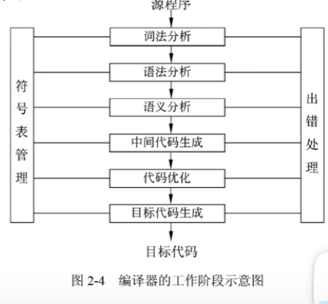

解释器运行过程：词法分析、语法分析、语义分析

编译器运行过程：词法分析、语法分析、语义分析、中间代码生成、代码优化、目标代码生成

解释器和编译器<mark>都有前三个步骤，且不可省略，且不能调换顺序</mark>

编译器<mark>可省略 中间代码生成、代码优化，但是不能省略目标代码生成</mark>

#### 2.1、符号表

符号表的作用是记录源程序中的各个符号的必要信息，以辅助语义的正确性检查和代码生成。

他会不断收集、记录和使用源程序的一些相关符号的类型和特征等信息，并存入符号表之中。

#### 2.2、词法分析

词法分析是源程序给到编译器的第一个阶段。编译器把源代码看成一个多行的字符串，词法分析就是对源程序从左到右逐字扫描，从中识别单词（关键字、标识符、常数、变量、运算符、分隔符）。

词法分析之前输入<mark>源程序</mark>

词法分析之后会输出 <mark>记号流</mark>

词法分析的主要作用是：<mark>分析构成语言的字符及由字符所组成的符号是否符号程序语言的规定</mark>。

#### 2.3、语法分析

语法分析的任务是在词法分析之上，根据语言的规则将单词符号分解成语法单位，如：表达式、语句、程序等，如果语法没有错误，那么就会构成语法树。否则指出语法错误。

语法分析的输入：<mark>记号流</mark>

语法分析的输出：<mark>分析树（语法树）</mark>

语法分析的作用：<mark>对各条语句的结构进行合法分析，分析程序中的句子结构是否正确。</mark>

#### 2.4、语义分析

语义分析分析各语法结构的含义，检查源程序是否包含静态语义错误，并收集类型信息供后面的代码生成使用。只有语法和语义都正确的源代码才能正确的翻译成目标程序。

语义分析的输入：<mark>语法树（分析树）</mark>

语义分析的主要作用：<mark>进行类型分析和检查</mark>

语义分析不能发现程序中的所有语义错误，它<mark>可以发现静态语义错误</mark>，<mark>不能发现动态语义错误</mark>，动态语义错误只有在运行时才能发现

#### 2.5、目标代码生成

目标代码生成是编译器工作的最后一个阶段。这一阶段的任务是把中间代码转换成特定机器上的代码。

<mark>目标代码生成阶段的工作与具体的机器密切相关</mark>

<mark>寄存器的分配工作处于目标代码生成的阶段</mark>

#### 2.6、动态语义错误

动态语义错误包括一些除数为0，或者进行死循环的情况

#### 2.7、中间代码

中间代码是一种简单且含义明确的记号系统，<mark>它们的特征与具体的机器无关</mark>

最常用一种中间代码是与汇编语言的指令有非常相似的<mark>三地址码</mark>，其实现方式长采用<mark>四元式</mark>

常见的中间代码：

​	<mark>后缀式、三地址码、三元式、四元式、树图</mark>

由于中间代码与具体的机器无关，<mark>可以将不同的程序语言翻译成同一种中间代码</mark>，所以可以实现跨平台，

<mark>使用中间代码有利于进行与机器无关的优化处理和提高编译程序的可移植性</mark>

#### 2.8、正规式

在<mark>词法分析</mark>中，将源程序的字符串转换成单词符号序列的集合，称为<mark>正规集</mark>，而正规集所表示的规律或者式子就叫做<mark>正规式</mark>

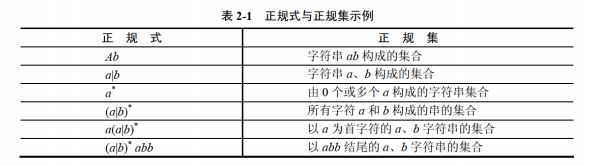

| 表示或  	*表示可以有0个或多个

#### 2.9、有限自动机

有限自动机是<mark>词法分析</mark>的一个工具，他能正确识别<mark>正规集</mark>

<mark>确定的有限自动机（DFA）</mark>：对每一个状态来说，字符转移后的状态是唯一的

<mark>不确定的有限自动机（NFA）</mark>：对每一个状态来说，字符转移后的状态是不唯一的

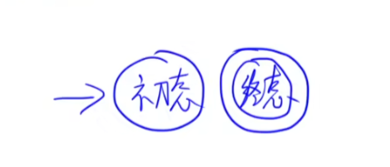

一个圈是初态，两个圈是终态。但是有可能两个圈的<mark>既是初态也是终态</mark>。

反写3 表示为空，可以直接跳过。

### 3、上下文无关文法

上下文无关文法被广泛的用于表示<mark>各种程序设计语言的语法规则</mark>

其实感觉跟有限自动机差不多

### 4、中缀式、后缀式转换

中缀式和后缀式都是中间代码生成的一种方式。

中缀式与我们日常生活方式差不多，喜欢<mark>把操作符放在两个数的中间</mark>

后缀式 则是<mark>将操作符放在两个数之后</mark>。

**中缀式与后缀式同样有操作符优先级问题**

1、（）（括号）

2、x   /  （乘 和 除）

3、+  -  （加、减）

<mark>当中缀式转换成后缀式时</mark>：

  当优先级相同时，<mark>从右向左进行</mark>（跟现实相反）

**根据语法树转换中缀式、后缀式**

中缀式：左根右

后缀式：左右根