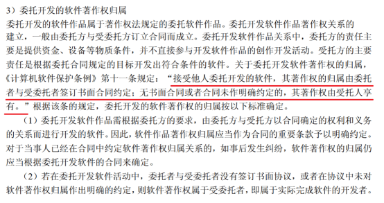
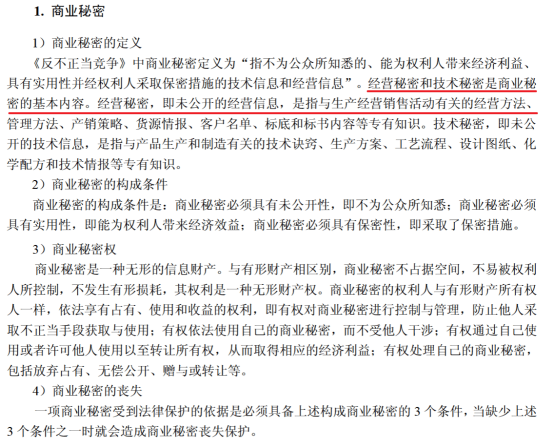
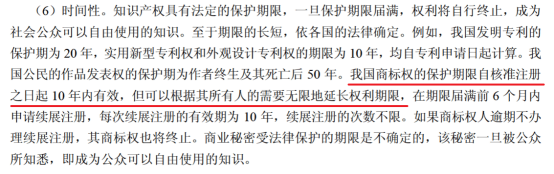

# 基础知识科目-标准化信息化和知识产权基础知识

知识产权

知识产权也称为智慧财产权

知识产权可分为**工业产权**和**著作权**两种

## 1、工业产权： 

包括专利，商标等......

## 2、著作权

著作权也叫版权，是指作者对其创作的作品享有的**人身权**和**财产权**。

人身权包括 <mark>发表权、署名权、修改权和保护作品完整权</mark>等。题目的选项除了这四个以外都是财产权

著作权权利中：署名权、修改权、保护作品完整权不受时间限制，受到永久保护。

发表权的保护期限为作者的终生及死后的50年

## 3、专利地域性

在中国申请的专利只在中国收到保护，在其它国家不受保护。

## 4、软件著作权

<mark>《中华人民共和国著作权法》和《计算机软件保护条例》</mark>是构成我国保护计算机软件著作权的两个基本法律文件

计算机软件著作权的权利自<mark>软件开发完成之日起产生</mark>

计算机软件著作权的客体是指   **计算机程序和相关文档**；

计算机程序包括：<mark>源程序和目标程序</mark>

文档一般指<mark>软件文档</mark>

## 5、职务作品

职务作品：**指在任职期间为完成公司单位工作任务而开发的计算机软件作品**。

一般来说都是为了完成公司的什么什么软件，和按公司规定完成软件文档。

都是属于职务作品。

 

职务作品中任职者<mark>只享有署名权</mark>， 除署名权以外的著作权权利均归公司享有。

## 6、委托开发

<mark>委托开发著作权归属：有合同约定遵守合同约定，没有合同约定著作权属于受委托方。</mark>

## 7、商业秘密权

## 8、专利权申请

<mark>专利权申请：先申请先得，同一天申请协商。</mark>

在日期上，先申请专利的可以获得专利权，如果在同一天申请，那就协商确定申请人，如果协商不成，就驳回所有人的申请，即所有申请人都不能取得专利权

## 9、商标权

## 10、商标注册

<mark>商标权注册先申请注册先得，同一天申请先使用商标先得，都没使用过则协商</mark>

**商标和专利不一样，商标谁先申请谁先用就是谁的，专利谁先申请就是谁的，否则私下协商，协商不好就抓阄⋯**