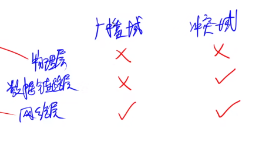
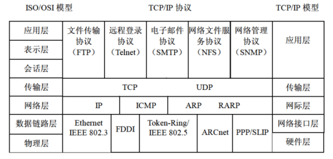
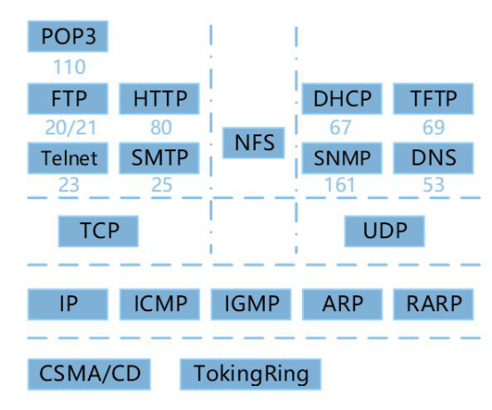
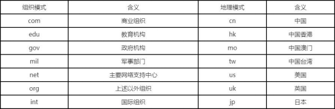
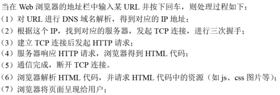
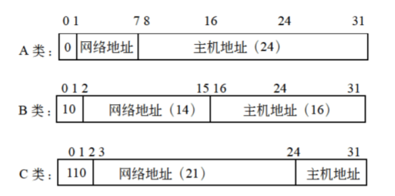
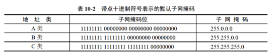
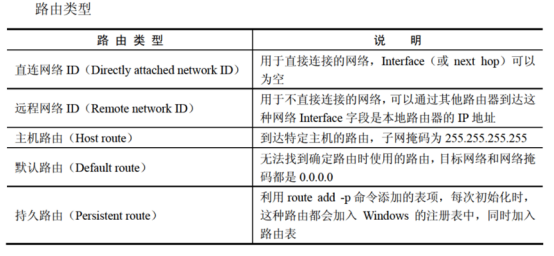
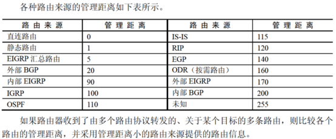

# 基础知识科目-网络与信息安全知识

## 1.计算机安全相关

### 1.1加密技术与认证技术

加密分为<mark>对称加密</mark>与<mark>非对称加密</mark>

#### <mark>对称加密：</mark>

<mark>加密和解密只有一把秘钥</mark>，而且是同一把秘钥，但是他的秘钥分发有缺陷

特点：

【1】加密解密速度很快

【2】适合加密大量数据

#### <mark>非对称加密（公开秘钥加密）</mark>：

非对称加密，加密和解密不是同一把秘钥，分为公钥和私钥，

<mark>用公钥加密只能用私钥解密，用私钥加密只能用公钥解密</mark>。不能通过其中一把推算出另外一把。

一般采用接收方的公钥加密明文，可以防止窃听效果。

特点：

【1】加密解密的速度很慢

#### 混合加密：

对称加密和非对称加密结合

#### 认证技术：

##### 	摘要：

​		将发送方的明文进行hash算法之后，放到密文后一起发过去。接收方接受到密文后解密成明文之后，再将明文进行hash算法，然后与发送方的hash算法值比较，如果相同，没有被篡改，如果不相同，那就是被篡改了

##### 	数字签名：

​		发送方将摘要用自己的私钥加密，放到密文后一起发过去；接受方用发送方的公钥解密摘要，得到hash值，再解密密文后得到的明文进行hash算法，最后与之比较。可以防止假冒

##### 	数字证书：

​		CA机构有专门的公钥和私钥

​	用CA机构的私钥签名，用CA机构的私钥验证数字证书的真伪性
​	数字证书可以确认网站的合法性，用户的身份等

### 1.2 加密算法

#### 1.2.1 对称加密算法（私钥加密算法/共享秘钥加密算法）：

​	对称加密采用了<mark>对称密码编码技术</mark>，其特点是<mark>文件加密和解密使用相同的密钥</mark>，这种方法在密码学中称为对称加密算法。

1、DES

2、3DES

3、RC-5

4、IDEA

5、AES   分组加密算法

6、RC4

#### 1.2.2 非对称加密算法：

1、RSA

2、ECC

3、DSA

既不属于对称也不属于非对称：

Hash函数

MD5摘要算法：对任意长度输入之后加密的算法都是128位

SHA-1安全散列算法

## 信息安全

### 1、防火墙

防火墙是建立在<mark>内外网络边界的过滤封锁机制</mark>。他认为<mark>内部网络是安全的、可信赖的</mark>，而<mark>外部网络是不安全的、不可信赖的</mark>。防火墙的作用是**防止 不希望的、不被授权的进出被保护的内部网络，通过边界控制内部网络的安全策略**。防火墙作为网络安全体系的基础和核心控制设施，贯穿于受控网络通信主干线，同时也承担着繁重的通信任务。由于自身也处于网络系统中的敏感位置，自身还要处理各种安全威胁，因此，选用一个安全、稳定和可靠的防火墙产品，是很重要的。

防火墙通常分为<mark>内网、外网和DMZ</mark>三个区域，

**DMZ称为“隔离区”，是为了解决安装防火墙后外部网络不能访问内部网络服务器的问题，**而设立的一个非安全系统与安全系统之间的缓冲区，这个缓冲区位于企业内部网络和外部网络之间的小网络区域内，在这个小网络区域内可以放置一些必须公开的服务器设施，如**企业Web服务器、FTP服务器和论坛**等

防火墙的技术经历阶段：

1）**包过滤防火墙**：

包过滤防火墙一般会有一个<mark>包检查器（包过滤器）</mark>，数据包过滤可以根据数据包头中的各项信息来控制站点与站点，站点与网络，网络与网络之间的相互访问，但<mark>无法控制传输数据的内容</mark>，因为内容是<mark>应用层数据</mark>，而<mark>包过滤器处于网络层和数据链路层</mark>。

通过检查模块，防火墙能够拦截和检查所有出站和进站的数据，它首先打开包，取出包头，根据包头的信息检查该包是否符合包过滤规则，并进行记录。对于不符合规则的包，应该进行报警并丢弃该包。

过滤型防火墙通常直接转发报文，它<mark>对用户完全透明，速度较快</mark>。

其优点是防火墙对**每条传入和传出网络的包实行低水平控制**：每个**IP地址**都要被检查，比如：源地址、目标地址、协议、端口。防火墙可以识别和丢弃带欺骗性IP地址的包；包过滤器防火墙是两个网络之间访问的唯一来源；包过滤器通常被包含在路由器的数据包中，所以不需要额外的系统来处理这个特征。

其缺点是，**不能防范黑客攻击**，因为网管不能区分可信网络与不可信网络的界限；不支持应用层协议，因为它不支持数据包中的应用层协议，访问控制粒度太粗糙，不能处理新的安全威胁。

2）**应用代理网关防火墙**：

应用代理防火墙彻底隔断内网与外网的直接通信，<mark>内网用户对外网的访问变成防火墙对外网的访问</mark>，然后由防火墙转发给内网用户。所有的通信必须从应用代理层软件转发，访问者任何时候都不能与服务器建立直接的TCP连接，应用层的协议会话过程必须符合代理的安全策略要求。

应用代理网关的优点是<mark>可以检查应用层、数据层、网络层的协议特征，对数据包的检测能力较强</mark>。

其缺点是<mark>难以配置，处理速度较慢</mark>。

3）**状态检测技术防火墙**：

结合了**应用代理防火墙的安全性和包过滤器防火墙的高速度**等优点，在<mark>不损失安全性的基础上，提高了代理防火墙的性能。</mark>

### 2、病毒

计算机的病毒特征：<mark>传播性、隐蔽性、感染性、潜伏性、触发性、破坏性</mark>

Worm表示蠕虫病毒，Trojan表示特洛伊木马，BackDoor表示后门病毒，Macro表示宏病毒

宏病毒感染的对象主要是<mark>文本文档、电子表格</mark>等

木马病毒：<mark>冰河</mark>

蠕虫病毒：<mark>欢乐时光、熊猫烧香、红色代码、爱虫病毒、震网</mark>

### 3、网络攻击

<mark>拒绝服务攻击(Dos攻击)</mark>:**目的是使计算机或网络无法提供正常的服务**

拒绝服务攻击(Dos攻击)是不断向计算机发出请求来实现的

<mark>重放攻击</mark>:“攻击者发送一个目的主机已经接受过的报文来达到攻击目的

攻击者利用网络监听或者其他方式盗取认证凭据，之后再重新发送给认证服务器。

主要用于身份认证过程，目的是破坏认证的正确性。

<mark>口令入侵攻击</mark>:使用某些合法用户的账号和口令登录到目的主机，然后再实施攻击活动

<mark>特洛伊木马</mark>:被伪装成程序或游戏，当用户下载了带有木马的软件或附件时，这个程序就会向黑客发起连接请求，建立连接后黑客就实施攻击活动。

<mark>端口欺骗攻击</mark>:采用端口扫描找到系统漏洞从而实施攻击

<mark>网络监听</mark>:攻击者可以接收某一网段在同--条物理通道.上传输的所有信息，使用网络监听可以轻松截取包括账号和口令在内的信息资料

<mark>IP欺骗攻击</mark>:产生的IP数据包为伪造的源IP地址，以便冒充其他系统或发件人的身份。

<mark>Sql注入攻击</mark>:是黑客对数据库进行攻击的常用手段之一。没有对用户输入数据的合法性进行判断，使应用程序存在安全隐患。攻击者可以提交一段数据库查询代码，根据程序返回的结果，获得某些他想得知的数据，首先获取数据库的权限，就可获取用户账号和口令信息，以及对某些数据修改等。.

<mark>入侵检测技术</mark>:专家系统、模型检测、简单匹配

### 4、网络安全

SSL 传输层安全协议，使用443端口

TLS 是SSL3.0的升级版

SSH是为远程登陆会话和其他网络服务提供的安全性协议。利用SSH可以有效的防止远程登陆过程中的信息泄露问题。

HTTPS是HTTP的加密版本，既使用SSL加密算法的HTTP。

MIME是一个互联网标准，扩展了电子邮件标准

PGP 是一个基于RSA公钥加密算法的邮件加密软件。可以对邮件保密以防止非授权用户查看，还能对邮件加上数字签名使收件人可以确认邮件的发送方

## 计算机网络

### 1、网络设备

<mark>物理层设备</mark>：中继器、集线器（是一种多端口的中继器）

<mark>数据链路层设备</mark>：网桥、交换机（是一种多端口的网桥）

<mark>网络层设备</mark>：路由器

<mark>应用层设备</mark>：网关

<mark>集线器不能自动寻址、集线器可以检测发送冲突。</mark>

<mark>物理层</mark>不能隔离广播域和冲突域（也就是所有的端口都是一个广播域和一个冲突域）

<mark>数据链路层</mark>能隔离冲突域但是不能隔离广播域

（也就是每一个端口都是一个冲突域，但是所有的端口还是一个广播域）

### 2、协议簇

<mark>TCP和UDP是在IP协议之上的</mark>

### 3、TCP和UDP

网络层协议IP，<mark>传输层协议TCP和UDP</mark>都是基于<mark>IP协议之上的</mark>，网络层协议除了IP，还有ICMP、ARP、RARP等。

IP所提供的服务都是<mark>无连接的和不可靠的</mark>。

传输层协议——TCP：<mark>面向连接可靠的传输层协议，采用三次握手建立和关闭连接</mark>

TCP的功能或服务有：**可靠传输、连接管理、差错校验和重传、流量控制、拥塞控制、端口寻址；其中流量控制采用的是：可变大小的滑动窗口协议**

传输层协议——UDP：<mark>用户数据报协议是一种不可靠的、无连接的协议，</mark>

UDP上的应用有VoIP等。**UDP的首部8B，TCP的首部20B，UDP相比TCP来说，开销较小。**

<mark>TCP和UDP均提供了端口寻址功能。</mark>

### 4、SMTP和POP3 电子邮件服务

**SMTP和POP3都是基于TCP之上的**

SMTP：发送邮件协议；端口号：**25**

SMTP只能<mark>传输SACII码文本和文字附件</mark>，可以<mark>使用MIME邮件扩充协议，添加其他类型的附件</mark> 以及增强私密性邮件保护（**PEM**）。

POP3：接收邮件协议；端口号：**110**

POP3基于<mark>C/S模式也就是Client/Server模式（客户端/服务器模式）</mark>

 

SMTP和POP3<mark>都使用TCP端口传输和接收邮件</mark>

### 5、ARP和RARP

ARP（Address Resolution Protocol,    ARP）**地址解析协议**和RARP**反地址解析协议**是网络层中的协议。

ARP和RARP协议在网络层工作，主要功能是<mark>实现IP地址和MAC地址之间的转换</mark>。

<mark>ARP采用广播（ARP Request）请求，单播（ARP Response）响应。</mark>

ARP是<mark>IP地址转换成物理地址（MAC地址）</mark>

RARP是<mark>将物理地址转换成IP地址</mark>

### 6、DHCP

DHCP（**动态主机配置协议**）

DHCP协议的功能是：<mark>集中的管理、分配IP地址，使网络环境中的主机动态的获得IP地址、Gateway地址、DNS服务器地址等信息，并能够提升地址的使用率。</mark>

 

<mark>DHCP客户端可以从DHCP服务器获得本机IP地址、DNS服务器地址、DHCP服务器地址和默认网关的地址等。</mark>

Windows无效地址：**169.254.X.X**		Linux无效地址：**0.0.0.0**

**169.254.X.X是Windows系统在DHCP信息租用失败时自动给客户机分配的IP地址。**

### 7、URL

<mark>协议名://主机名.域名.域名后缀.域名分类/目录/网页文件</mark>

### 8、浏览器

DNS域名查询的次序是:<mark>本地的hosts文件→本地DNS缓存→本地DNS服务器→根域名服务器。</mark>

### 9、IP地址和子网划分

<mark>主机地址全0为网络地址，全1为广播地址</mark>

在Internet中，IP地址可以分为5类，A、B、C、D、E类

**A类**：第一位为0，剩下7位表示网络地址，后面24位为主机地址，<mark>共提供224 -2个端口寻址，因为要减去全0和全1的地址</mark>。

A类地址的<mark>网络位 限制为000~127</mark>。

**B类**：前2位是10，剩下14位表示网络地址，后面16位为主机地址，<mark>B类的全部地址有(214 -2)x(216 -2)个地址</mark>

B类地址的<mark>网络位 限制为128~191</mark>。

**C类**：前三位是110，剩下的21位表示网络地址，后面8位表示主机地址，<mark>C类地址支持221 - 2个网络，每个网络支持28 -2个地址</mark>

C类地址的<mark>网络位限制为192~223</mark>。

**D类**： 的识别头是1110，用于组播，例如路由器修改，<mark>网络限制为224~239</mark>。

**E类**：为实验保留，识别头是1111，<mark>网络限制为240~255</mark>。

**子网掩码**：

子网掩码就是<mark>网络地址全1，主机地址全0</mark>。

### 10、IPv6

IPv6 支持128位的地址空间，IPv4只支持32位的地址空间，也就是<mark>IPv4只能最多232</mark>，<mark>而IPv6支持2128</mark>

### 11、无线网络

<mark>蓝牙覆盖范围最小和通信距离最短</mark>

### 12、Windows命令

ipconfig/release：DHCP客户端手工释放IP地址

ipconfig/flushdns：清除本地DNS缓存内容

ipconfig/displaydns：显示本地DNS内容

ipconfig/registerdns：DNS客户端手工向服务器进行注册

ipconfig：显示所有网络适配器的IP地址、子网掩码和缺省网关值

ipconfig/all：显示所有网络适配器的完整TCP/IP配置信息，包括DHCP服务是否已启动

ipconfig/renew：DHCP客户端手工向服务器刷新请求（重新申请IP地址）

### 13、路由

