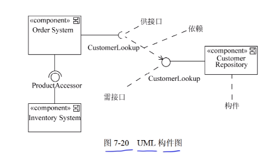
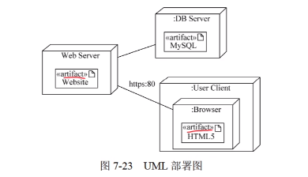

# 基础知识科目-面向对象基础知识

## 面向对象

### 1、类

一个类所包含的**数据和方法**描述一组对象的<mark>共同行为和特征</mark>。把一组对象的共同特征加以抽象化并存储在一个类中是面向对象技术最重要的一点。

类是在对象之上的抽象，对象是<mark>类的具体化</mark>，是<mark>类的实例化</mark>

类可以分为3种：

<mark>实体类</mark>：

实体类的对象表示现实世界中真实的人或物

<mark>接口类（边界类）</mark>：

接口类的对象为用户提供	一种与系统结合交互的方式，分为人和系统两大位，其中人的接口可以是显示屏、窗口、Web窗口、对话框

系统接口涉及到把数据发送到其他系统，或者从其他系统接收数据。

<mark>控制类</mark>：

控制类的对象用来控制活动流，充当协调者


有些类之间会有一般和特殊的关系，这其实就是父类和子类，**一般就是父类，特殊就是子类**

### 2、对象

对象是类的实例化，是运行时的实体。它包括 <mark>数据</mark>（也叫属性、状态、成员变量）、作用于数据的<mark>操作</mark>（也叫行为、方法、函数、成员函数）

所以，一个对象把属性和行为封装成一个整体。一个对象通常由<mark>对象名、属性、方法</mark>三个部分组成

### 3、消息

对象之间通信的一种构造叫做消息。当一个消息发送给某种对象时，包括要求接收对象去执行某些活动的信息。接收到信息的对象经过解释，予以响应。这种通信机制被称为消息传递。

其实就跟调方法，传参数一样。


### 4、方法重载

方法名相同 ，参数不同（分三种： 参数个数不同，参数类型不同，参数顺序不同）

### 5、封装

一个对象会把自身的属性和行为封装起来。封装是一种<mark>信息隐蔽技术</mark>，它的目的是将对象是使用者和生产者分离，使对象的定义和实现分开

### 6、继承

继承是子类和父类之间共享数据和方法的机制。这是类之间的一种关系，在定义和实现这个类的时候，可以在这个类的基础上进行，并添加属于自己的内容。


一个父类可以有多个子类。如果一个子类只继承了一个父类，这叫 <mark>单重继承</mark>。 如果一个子类有两个父类或者多个父类，这叫 <mark>多重继承</mark>


### 7、多态

在收到消息时，<mark>不同的对象收到同一个消息可以产生不同的结果</mark>，这一现象称为多态。在使用多态的时候，用户可以发送一个通用信息，而实现的细节则由接收对象自行决定。这样，同一消息就可以调用不同的方法。

<mark>多态的实现受到继承的支持</mark>。

多态有4种不同的形式：**参数多态、包含多态、过载多态、强制多态**。

其中 参数多态和包含多态被称为 通用的多态，过载多态和强制多态被称为特定的多态。

<mark>参数多态是应用比较广泛的多态，被称为最纯的多态</mark>

<mark>包含多态在很多语言中都存在，最常见的例子是子类型化，即一个类型是另一个类型的子类型</mark>

<mark>过载多态是同一个名字在不同的上下文中所代表的含义不同</mark>


### 8、动态绑定和静态绑定

绑定是指一个把过程响应和响应调用所需执行的代码结合起来。在一般的程序中，<mark>绑定是在编译期间进行的，叫做静态绑定</mark>。而在<mark>运行期间才进行绑定的，叫做动态绑定</mark>

动态绑定是和类的<mark>继承和多态相联系的</mark>

### 9、面向对象设计的原则

<mark>**1、单一责任原则（SRP：Single responsibility principle）**</mark>

就一个类而言，应该仅有一个引起它变化的原因。即，当需要修改某个类的时候 原因有且只有一个，让一个类只做一种类型责任。

<mark>**2、开放-封闭原则（OCP，Open Closed Principle）**</mark>

软件实体应该是可以扩展的，开放的；但是不能修改的，即封闭的

**<mark>3、里氏替换原则（Liskov Substitution Principle LSP）</mark>**

子类型必须能够替换掉他的父类型。即，在任何父类出现的地方，子类一定可以出现。

**<mark>4、依赖倒置原则（Dependence Inversion Principle）</mark>**

抽象不应该依赖于细节，细节应该依赖于抽象。即，高层模块不应该依赖与底层模块，二者都应该依赖与抽象。

**<mark>5、接口分离原则（Interface Segregation Principle  ISP）</mark>**

依赖于抽象，不应该依赖于细节

接口分离原则指在设计时采用多个与特定客户类有关的接口比采用一个通用的接口要好。即，一个类要给多个客户使用，那么可以为每个客户创建一个接口，然后这个类实现所有的接口；而不要只创建一个接口，其中包含所有客户类需要的方法，然后这个类实现这个接口

**<mark>6、共同重用原则（Common Reuse Principle CRP）</mark>**

共同重用原则，[面向对象编程]术语，指一个包中的所有类应该是共同重用的。如果重用了包中的一个类，那么也就相当于重用了包中的所有类

**<mark>7、共同封闭原则（Common Closure Principle CCP）</mark>**

共同封闭原则：包中的所有类对于同一种性质的变化应该是共同封闭的。一个变化若对一个封闭的包产生影响，则将对该包中的所有类产生影响，而对于其他包则不造成任何影响

### 10、面向对象分析

面向对象分析的目的是为了获取对<mark>应用问题的理解</mark>，理解的目的是<mark>确定系统的功能、性能要求</mark>。

面向对象分析包含5个活动：认定对象、组织对象、描述对象之间的相互作用、确定对象的操作、定义对象的内部信息

**1、认定对象**

在应用领域中，按照自然存在的实体确认对象。在问题定义域中，将自然存在的“名词”作为一个对象，困难在于寻找系统关心的实质性对象，实质性对象是系统稳定性的基础。例如在银行系统中，实质性对象包括客户账户、清算等，而门卫值班不是实质性对象，甚至不在该系统中。

**2、组织对象**

**3、对象之间的相互作用**

**4、基于对象的操作**

### 11、面向对象设计

面向对象设计（OOD）是将面向对象分析（OOA）所创建的分析模型转换成设计模型，其目标是定义系统构造蓝图。OOA与OOD之间不存在鸿沟，采用一致的概念和一致的表示法，OOD同样遵循抽象、信息屏蔽、功能独立、模块化等设计原则。

OOD在复用OOA的模型的基础上，包含与OOA所对应的五个活动：

1、识别类和对象

2、定义属性

3、定义服务

4、识别关系

5、识别包

### 12、面向对象测试

就测试而言，面向对象测试与其他方法开发的测试并没有什么不同。

一般来说，面向对象测试可分为4个层次进行：

1、算法层

2、类层

3、模块层

4、系统层

### 13、面向对象程序设计

程序设计范性是人们在程序设计时所采用的基本方式模型，决定了程序设计时，所采用的思维方式、使用的工具、同时有一定的应用范畴。其发展历程经历了

<mark>过程程序设计、模块化程序设计、函数程序设计、逻辑程序设计、发展到现在的面向对象程序设计范性</mark>。

面向对象程序设计（OOP）的实质是选用一种面向对象程序设计语言，采用对象、类、及其相关概念所进行的程序设计。它的关键在于加入了类和继承性，从而进一步提高了抽象程度，特定的OOP概念一般是从OOPL中特定的语言机制来实现的。OOP现在已经扩展到了系统分析和软件设计的范畴，出现了面向对象分析和面向对象设计的概念。

## UML

### 1、uml概念

UML统一建模语言，统一建模语言是面向对象软件的标准化建模语言。由于其简单、统一，又能够表达软件设计中的<mark>静态和动态信息</mark>。

ULM由3个要素构成：**UML的基本构造块**、**支配这些构造块如何放置在一起的规则**和**运用于整个语言的一些公共机制**。

UML的词汇表包含3种构造块：<mark>事物、关系、图</mark>

事物是对模型中最具有代表性的成分的抽象；关系把事物结合在一起；图聚集了相关的事物；

### 2、事物

UML中一共有4种事物，结构事物、行为事物、分组事物、注释事物

**<mark>1、结构事物</mark>**

结构事物是UML模型中的名词，通常是模型的静态部分，描述概念和物理元素。

结构事物包括 类、接口、协作、用咧、主动类、构件、制品、结点


**<mark>2、行为事物</mark>**

行为事物是UML模型中的**动词**，是UML中的**动态部分**，描述了跨越时间和空间的行为。行为事物包括交互、状态机、活动


**<mark>3、分组事物</mark>**

分组事物是UML模型的**组织部分**，是由一些模型分解成的盒子。在所有的分组事物中，最重要的分组事物是**包**。包是把元素组织成组的机制，这种机制有很多用途。

结构事物、行为事物甚至其他事物都可以放进包内。包与构件不同，它纯粹是概念上的


**<mark>4、注释事物</mark>**

注释事物是UML模型的解释部分。这些注释事物用来描述、说明、和标注模型的任何元素。<mark>注解</mark>是一种主要的注释事物。**注解是一个依附于一个元素或者一组元素之上，对他进行约束或者解释的简单符号**

### 3、关系

UML中有4种关系：**依赖、关联、泛化、实现**

**<mark>1、依赖</mark>**

依赖是两个事物间的语义关系，其中一个事物（独立事物）发生变化会影响另一个事物（依赖事物）的语义。在图形上，把依赖画成一条有方向的虚线


其中，箭头指向的一方为<mark>独立事物</mark>，另一方为<mark>依赖事物</mark>


**<mark>2、关联</mark>**

关联是一种结构关系，它描述了一组链，链是对象之间的链接。聚集是一种特殊类型的关联，它描述整体与部分的结构关系。

在图形中，关联是一条直线，关联上可以标注<mark>重复度和角色</mark>


在聚合关系中，<mark>直线的一边是部分，菱形的一边是整体</mark>

**聚合**：部分和整体的生命周期不一致，整体消失了，部分仍然存在，部分可以脱离整体的存在

在组合关系中，它的菱形是**实心的**

**组合**：部分和整体的生命周期一致，整体消失了，部分也消失了，部分不可以脱离整体的存在


**<mark>3、泛化</mark>**

泛化是一种特殊/一般的关系，特殊元素（子元素）可以替换一般元素（父元素）的对象。子元素共享了父元素的结构和行为。在图形上，把一个泛化关系画成

一条带空心箭头的实线，他指向父元素。


**<mark>4、实现</mark>**

实现是类元之间的语义关系，其中，一个类元指定了由另一个类元保证执行的契约。在两种情况下，会使用实现关系，一种是在接口和实现它们的类或构件之间；

另一种是在用例和实现它们的协作之间。在图形上，把一个实现关系画成一条带有空心箭头的虚线。


### 4、关联多重度

上面的关联关系是双重关联的，用一根直线表示。

下面介绍单向关联，单向关联是指只有一方关联另一方，单向关联需加上关联名。

关联类指的是一方关联另一方，存在多对多的关系，而且自身主键不能确定多对多唯一关系，所以 关联类就是那个确定唯一关系的类

### 5、UML的图

图是一组元素的表示。UML中提供了13种图。分别是<mark>类图、对象图、用例图、序列图、通信图、状态图、活动图、构件图、组合结构图、部署图、包图、交互概念图、计时图。序列图、通信图、交互概览图、计时图</mark>被统称为交互图。

### 6、类图

类图展示了一组对象、接口、协作和它们之间的关系。在面向对象系统中建模中最常见的图就是类图。

一般类图包含以下内容：

1、类

2、接口

3、协作

4、依赖、泛化、关联关系


在属性和方法前，会存在一个修饰符，一共有+、-、#、~

+：表示公开的，public

-：表示私有的，private

#：表示受保护的，proceted

~：表示包的，package


类图也可以包含注解和约束。类图还可以有包或子系统，二者都用于把模型元素聚集成更大的组块。

类图用于对系统的静态设计视图建模。这种视图主要支持系统的<mark>功能需求</mark>，即系统要提供给最终用户的服务。当对系统设计静态设计视图建模时，通常用下述3种方式：

1、对系统的词汇建模

2、对简单的协作建模

3、对逻辑数据库模式建模

### 7、对象图

对象图展示了某一个时刻<mark>一组对象以及它们之间的关系</mark>，描述了在类图中所建立的事物的<mark>实例的静态快照</mark>。对象图一般包括对象和链。

对象图一般会有冒号， 类似 【对象名：类名】，下面是属性值


和类图一样，他们都是静态设计视图或静态进程设计视图。

### 8、用例图

用例图展示了一组用例、参与者、以及它们之间的关系。用例图一般包含以下内容：

1、用例

2、参与者

3、用例之间的扩展关系《extends》和包含关系《include》，参与者与用例之间的关联关系。用例与用例之间，参与者与参与者之间的泛化关系。


**<mark>1、包含关系</mark>**

包含关系一般在图中表示为<mark>一个有方向的虚线</mark>，并且在上面标注《include》。箭头指向的一方为<mark>被包含用例</mark>，另一方为基础用例（包含用例）


**<mark>2、扩展关系</mark>**

一个用例执行的时候，可能会发生一些特殊的情况或可选的情况，这种情况就是这个用例的扩展用例

扩展关系一般在图中表示为<mark>一个有方向的虚线</mark>，并且在上面标注《extend》。箭头指向的一方为<mark>基本用例</mark>，另一方为<mark>扩展用例</mark>


**<mark>3、泛化关系</mark>**

一般泛化就是父子继承关系。


用例图对于系统的静态用例视图进行建模。这个视图主要支持系统的行为。即该系统在周边环境语境中所提供的外部可见服务。

当对系统的静态用例视图建模时，可以用以下两种方式来使用例图

1、对系统的语境进行建模

2、对系统的需求进行建模


### 9、交互图

交互图是对系统的动态方面进行建模。一张交互图表现的是一个交互，<mark>由一组对象和它们之间的关系组成，包含它们之间可能传递的消息。</mark>

交互图表现为**序列图、通信图、交互概览图和计时图**，每种针对不同的目的，能适用于不同的情况。

<mark>序列图强调消息时间顺序的交互图</mark>

<mark>通信图强调接收和发生消息的对象的结构组织的交互图</mark>

<mark>交互概览图强调控制流的交互</mark>

交互图一般包含**对象、链、消息**

#### 9.1、序列图

序列图又叫**顺序图**

序列图是场景的图形化表示，描述了以<mark>时间顺序组织的对象之间的交互活动</mark>

序列图首先把参加交互的对象放在图的上方，沿水平方向排列；通常把发起交互的对象放在左边，下级对象依次放在右边；然后，把对象的发送和接收的消息沿垂直方向按时间顺序从上到下放置。这样，就提供了控制流随时间推移的清晰的可视化轨迹。


**序列图有两个不同于通信图的特征**：

1、<mark>序列图有对象的生命线，生命线是垂直的虚线。</mark>

2、<mark>序列图有控制焦点，控制焦点就是虚线上的矩形</mark>


消息类型：


#### 9.2、通信图

通信图<mark>强调收发消息的对象的结构组织</mark>，在早期版本中，通信图也叫<mark>协作图</mark>；

一张通信图，首先要将参加交互的对象作为图的顶点，然后把这些连接对象的链表示为图的弧，最后，用对象发送和收到的消息来修饰这些链。


**通信图有两个不同与时序图的特征**：

1、<mark>通信图有路径</mark>。为了指出一个对象与另一个对象链接，可以在链的末端附上一个路径构造型（如：构造型）

2、<mark>通信图有顺序号</mark>；有表示消息的时间顺序

**通信图和时序图是相同的，他们可以互相转换**


#### 9.3、状态图

状态图展示了一个状态机，它由<mark>状态、转换、事件、活动</mark>组成；状态图注重系统的动态视图，对于接口、类、协作的行为建模尤为重要，<mark>强调对象行为的事件顺序</mark>


**<mark>1、状态和活动</mark>**

状态又包括简单状态和复合状态；

状态是任何可以被观察到的系统行为模式，一个状态代表系统的一种行为模式，状态规定了系统对事件的响应方式。系统对事件的响应，即可以是一个动作，也可以是改变系统本身的状态，还可以即改变状态，又是一个动作；

在状态图中，状态一共有3种<mark> 初态（初级状态）、终态（终极状态）、中间状态</mark>

初态用一个<mark>实心黑圆</mark>表示，终态用<mark>黑圆点外加一个圆</mark>表示，中间状态<mark>用一个圆角四边形表示（用两条横线把它分成上、中、下三个部分）</mark>，上：状态的名称（必须有的）中：状态变量的名称和值（可选的）下：活动表（可选的）；状态与状态之间为状态转换，用一条带剪头的直线。带箭头的线上的事情发生时，<mark>状态转换开始</mark>（也叫状态点火或者转换被触发）。

一张状态图只能<mark>有一个初态</mark>，<mark>终态可以没有，也可以有多个</mark>；


其中，中间状态的活动表的语法格式如下：

<mark>事件名/动作表达式</mark>，

其中，“事件名”可以是任何事件的名称。在活动表中经常使用下述3种标准事件：**entry、exit、do**

**entry**：入口动作，进入状态，立即执行

**exit**：出口动作，退出状态，立即执行

**do**：内部活动，占有有限时间，并可以中断的工作


<mark>**2、转换和事件**</mark>

**事件**：

事件是在某个特定时刻发生的事情，它是对引起系统动作或从一个状态转换到另一个状态的外界事件的抽象

例如：观众使用电视遥控器，用户移动鼠标，单击鼠标等操作。

简而言之，事件就是引起系统的做动作和转换状态的控制信息。

**转换**：

转换也叫迁移。转换包括两个状态，一个原状态、一个目标状态。

<mark>转换有两种方式</mark>：

1、由事件触发的，这种情况下，应在状态转换上的箭头线上标注触发条件的**事件表达式**。

2、如果在箭头上未标注明事件，则表示在**源状态的内部活动执行完毕**之后自动触发。

事件表达式的语法如下：

​	<mark>**事件说明[监护条件]/动作表达式**</mark>

<mark>**活动**</mark>（动作）可以在<mark>状态</mark>（迁移）内执行，也可以在<mark>状态</mark>（迁移）转换时执行；

监护条件是一个布尔表达式。如果同时使用事件说明和监护条件，当且仅当事件发生和监护条件为真时，状态转换才发生。如果只有监护条件没有事件说明，则只要监护条件为真，状态转换才发生。


#### 9.4、活动图

活动图是一种特殊的状态图。它展现了在系统内从<mark>一个活动到另一个活动</mark>的流程。

活动图专注于系统的动态视图，它对于**系统的功能建模十分重要**，并强调**对象间的控制流程**。


### 10、构件图（组件图）

构件图展示了一组构件之间的组织和依赖。构件图专注于系统的静态实现视图。



构件图的中的构件在右上角都会有这个标志


一般在图中一根线加一个半圆是 <mark>需接口</mark>

一般在图中乙肝先加一个整园是 <mark>供接口</mark>

（注意：图是错的，相反就对了）


<mark>供接口一般依赖于需接口</mark>

功能实现都是需接口所在的构件实现的

### 11、部署图

部署图 是用来对面向对象系统的物理方面建模的方法，展示了运行时处理结点以及其中的构件的配置。部署图对系统的静态部署视图进行建模，它与构件图相关。

通常，一个结点是一个在运行时存在并代表一项计算资源的物理元素，至少拥有一些内容，常常具有处理能力，包含一个或多个构件。



部署图展示了系统软件与硬件之间的关系，在实施阶段使用。

### 12、UML图总结

<mark>静态建模：类图、对象图、用例图</mark>

<mark>动态建模：序列图（也叫顺序图、时序图）、通信图（也叫协作图）、状态图、活动图</mark>

<mark>物理建模：构件图（也叫组件图）、部署图</mark>


<mark>交互图：序列图（也叫顺序图、时序图）、通信图（也叫协作图）</mark>

## 设计模式


### 1、设计模式要素

设计模式的核心在于<mark>提供了相关问题的解决方案</mark>，使得人们更加<mark>简单、方便的复用成功的设计和体系结构</mark>。

**设计模式的四个要素**：

1）模式名称

2）问题

3）解决方案

4）效果


### 2、设计模式分类


### 3、创建型模式

类创建型模式使用继承改变被实例化的类，而一个对象创建型模式将实例化委托给另一个对象。

这个模式的特点：

1）它们都将关于该系统使用哪些具体的类的信息封装起来。

2）它们隐藏了这些类的实例是如何被创建和放在一起的。整个系统关于这些对象所知道的是由抽象类所定义的接口。

#### 3、1简单工厂模式

简单工厂模式不属于设计模式之一，但是也是创建型模式。

**定义**：<mark>定义一个工厂类，它可以根据参数的不同 返回不同类的实例，被创建的实例通常具有相同的父类</mark>

在简单工厂模式中，用于创建实例的方法通常都是静态方法，因此简单工厂模式也叫静态工厂模式。


```java
public class SimpleFactory {
    public static void main(String[] args) {
        Product a = Factory.createProduct("A");
        a.info();
    }
}


class Factory {
    static Product createProduct(String type){
        Product product = null;
        switch (type){
            case "A":
                product = new ProductA();
                break;
            case "B":
                product = new ProductB();
                break;
            default:
                System.out.println("type类型不符合");
                break;
        }
        return product;
    }
}


abstract class Product{
    abstract void info();
}

class ProductA extends Product{

    @Override
    void info() {
        System.out.println("产品A");
    }
}

class ProductB extends Product{

    @Override
    void info() {
        System.out.println("产品B");
    }
}
```

这个模式有一定的问题，比如当type类型增加的时候，需要修改源码，这其实不好，<mark>接下来的工厂方法模式就解决了这个问题</mark>

#### 3、2工厂方法模式

**定义**：<mark>定义一个用于创建对象的接口，让子类决定实例化哪一个类，使其类的实例化延迟到子类</mark>


```java
public class FactoryMethod {
    public static void main(String[] args) {
        Factory a = new ProductAFactory();
        Product producta = a.createProduct();
        producta.info();

        Factory b = new ProductBFactory();
        Product productb = b.createProduct();
        productb.info();
    }
}

interface Factory{
    Product createProduct();
}

class ProductAFactory implements Factory{

    @Override
    public Product createProduct() {
        return new ProductA();
    }
}
class ProductBFactory implements Factory{

    @Override
    public Product createProduct() {
        return new ProductB();
    }
}


interface Product{
    void info();
}

class ProductA implements Product{

    @Override
    public void info() {
        System.out.println("产品A");
    }
}
class ProductB implements Product{

    @Override
    public void info() {
        System.out.println("产品B");
    }
}
```

#### 3、3抽象工厂模式

**定义**：<mark>创建一系列相关或者相互依赖对象的接口，而无须指定他们具体的类</mark>


#### 3、4生成器模式

**定义**：<mark>将一个复杂对象的创建与它的表示分离，使得同样的构建过程可以创建不同的表示</mark>


#### 3、5原型模式

**定义**：<mark>用原型实例指定创建对象的种类，并且通过复制这些原型来创建新的对象</mark>。


#### 3、6单例模式

**定义**：<mark>保证一个类只有一个实例，并提供一个访问它的全局代理。</mark>