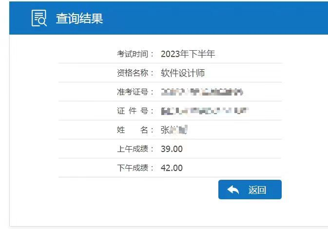

# 博主软考之旅

>  zst的B站账号：[https://space.bilibili.com/91286799](https://space.bilibili.com/91286799) （大家多多关注，真是大好人！）
>
>  zst学习路线地址：[https://www.bilibili.com/read/cv18526892/](https://www.bilibili.com/read/cv18526892/)
>
>  zst学习资料地址：
>
>  ​	阿里云盘：[https://www.aliyundrive.com/s/dMmNyUXMYgU](https://www.aliyundrive.com/s/dMmNyUXMYgU ) 
>
>  ​	百度网盘：[https://pan.baidu.com/s/1URd4tl_iFjAMZxgxcHqAFg?pwd=2022](https://pan.baidu.com/s/1URd4tl_iFjAMZxgxcHqAFg?pwd=2022)
>
>  ​	百度网盘提取码：2022

## 祝愿

**祝愿看到这里的朋友都能一把过！！！ 大家加油！！！**

## 关于软考

软考是计算机技术与软件专业技术资格（水平）考试的简称，它是由国家人力资源和社会保障部、工业和信息化部领导下的国家级考试，并且它既是职业资格考试，又是职称资格考试，还是水平考试。

### 软考项目

计算机软件资格考试设置了27个专业资格，涵盖5个专业领域， 3个级别层次（初级、中级、高级）

### 软考时间

软考一年有两次考试时间，分别是**5月底和11月初**，但有部分考试时间只有一次，高级科目都只有一次。具体查看官网：https://www.ruankao.org.cn/index.html

### 软考作用

软考证书的含金量很高，其主要有以下5个作用：

**1.个税抵扣**

这是最直接的作用，考完后在个人所得税APP就可直接申请了。按相关规定，拿到软考证书的那一年，可以扣除3600元内的个税。

**2.评职称**

在国企和体制内工作可评职称，中级评中级职称，高级就可以评副高级职称。例如：高项（信息系统项目管理师）考出来则直接可以评副高职称。

**3.积分落户**

根据城市而定，有些城市落户是需要满足多少积分的，一般只在一线城市有用。而软考过了则可以加分。以上海为例，中级证书可以加100分，而高级职称则可以加140分。

**4.公司招投标**

现在公司想要有项目，就离不开招投标，例如此项目需满足高级工程师3名、中级工程师5名类似，职称人员数量会影响投标结果，这里也涉及到一个灰色地带，则是挂K，有些公司对于技术人才不满足条件，则会开出高价收资质，但这项目前也算wf的，建议不要轻易尝试，挂给自己所在公司，否则项目出问题要负责任的。所以很多公司会鼓励自己员工参加相关考证考试，有利于公司招投标，公司也会个个人一定的现金奖励的。

**5.个人能力的提升**

不管考证是因为什么原因，在备考学习的过程中自己会学到很多专业知识，对自己的能力有一定的提升，可以提高在个人的核心竞争力。

## 开始

在今年我开始准备报考软件设计师，也就是2023年11月份。上下班的缘故，回来就不想动。学了一些，但是没学完。

## 结果

2023.12.7号 出成绩了 本来我还报有一些侥幸感觉能过，查了分数发现是我错了 :sob:

明年我会继续的，加油！！！ 后续持续更新！